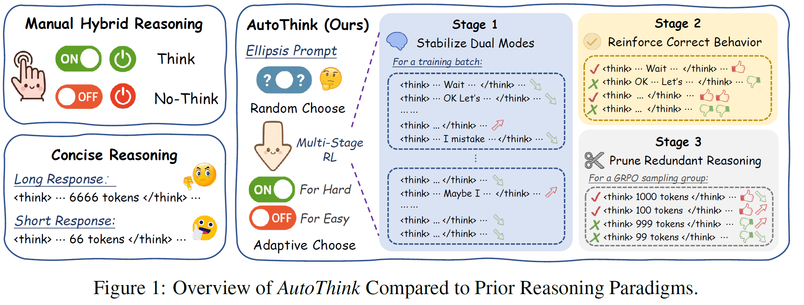
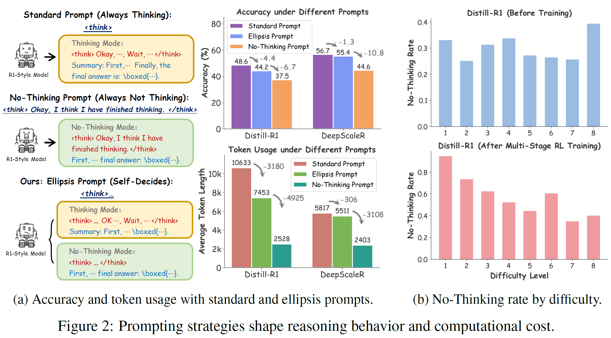
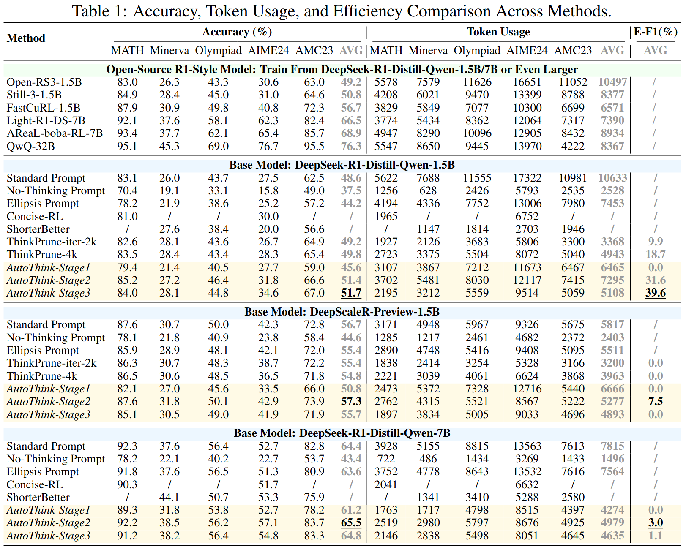

# 🧠 AutoThink: Adaptive Reasoning in R1-Style Models


<p align="center">
          🤗 <a href="https://huggingface.co/Qwen">Hugging Face</a>&nbsp&nbsp | &nbsp&nbsp📑 <a href="https://modelscope.cn/organization/qwen">Paper</a>&nbsp&nbsp
</p>


<!-- <p align="center">
          💜 <a href="https://chat.qwen.ai/"><b>Qwen Chat</b></a>&nbsp&nbsp | &nbsp&nbsp🤗 <a href="https://huggingface.co/Qwen">Hugging Face</a>&nbsp&nbsp | &nbsp&nbsp🤖 <a href="https://modelscope.cn/organization/qwen">ModelScope</a>&nbsp&nbsp | &nbsp&nbsp 📑 Paper &nbsp&nbsp | &nbsp&nbsp 📑 <a href="https://qwenlm.github.io/blog/qwen3/">Blog</a> &nbsp&nbsp ｜ &nbsp&nbsp📖 <a href="https://qwen.readthedocs.io/">Documentation</a>
<br>
🖥️ <a href="https://huggingface.co/spaces/Qwen/Qwen3-Demo">Demo</a>&nbsp&nbsp | &nbsp&nbsp💬 <a href="https://github.com/QwenLM/Qwen/blob/main/assets/wechat.png">WeChat (微信)</a>&nbsp&nbsp | &nbsp&nbsp🫨 <a href="https://discord.gg/CV4E9rpNSD">Discord</a>&nbsp&nbsp
</p> -->


**AutoThink** is a reinforcement learning framework designed to equip R1-style language models with **adaptive reasoning** capabilities. Instead of always thinking or never thinking, the model learns **when** to engage in explicit reasoning, balancing performance and efficiency.

This repository implements **AutoThink**, as described in our paper:

> *Learning When to Think: Shaping Adaptive Reasoning in R1-Style Models via Multi-Stage RL*  
> Anonymous Authors (Under Review)


---

## 🚀 Features

- 🧩 **Minimal Prompting** with ellipsis (`<think>\n...\n`) to activate stochastic thinking.
- 🎯 **Multi-stage RL** to stabilize, reinforce, and prune reasoning behavior.
- ⚙️ Integrated with the [`verl`](./verl) framework.
- 📊 Benchmarked on five mathematical reasoning datasets: MATH, Minerva, Olympiad, AIME24, AMC23.



---

## 📁 Repository Structure

```
code-release/
├── verl/               # Core training framework (based on verl)
├── deepscaler/         # Data preprocessing and utility scripts
├── scripts/            # Launch scripts and experiment configs
```

---

## 📦 Installation

Please clone the official [DeepScaleR](https://github.com/agentica-project/rllm) repository and follow its setup instructions:

Then, **replace the following three folders** in the original repo with ours:

```bash
cp -r code-release/verl     deepscaler/
cp -r code-release/scripts  deepscaler/
cp -r code-release/deepscaler deepscaler/
```

Install the environment:
```bash
# Recommend Python 3.10.
cd deepscaler
pip install -e ./verl
pip install -e .
```

The raw training data is located in `deepscaler/data/[train|test]`, along with preprocessing scripts. To convert the raw data into Parquet files for training, run:

```bash
# Output parquet files in data/*.parquet.
python scripts/data/deepscaler_dataset.py
```

---

## 🧠 Different Prompt Strategies

You can control the model's reasoning behavior by modifying the `chat_template` field in `tokenizer_config.json`. Update the value with one of the following:

- **Standard Prompt** (default for Distill-R1, no changes needed):

```json
"<|Assistant|><think>\n"
```

- **No-Thinking Prompt** (forces minimal reasoning):

```json
"<|Assistant|><think>\nOkay, I think I have finished thinking.\n</think>\n\n"
```


- **Ellipsis Prompt** (adaptive reasoning mode):

```json
"<|Assistant|><think>\n...\n"
```


These prompts enable different reasoning behaviors.  
Before AutoThink training, please replace the default `chat_template` with **Ellipsis Prompt** and keep the inference prompt consistent.


## 🏋️ Training

AutoThink training proceeds in **three stages** with different reward designs:

```bash
# Stage 1: Stabilize dual-mode reasoning
bash scripts/train_stage1.sh

# Stage 2: Reinforce accurate behavior
bash scripts/train_stage2.sh

# Stage 3: Prune redundant reasoning
bash scripts/train_stage3.sh
```

Make sure to configure your model paths and data in `scripts/train_*.sh`.


---

## 📈 Evaluation

After training, evaluate the model using:

```bash
bash scripts/eval/eval_model_1.5b.sh
```


---


## 📊 Results

AutoThink achievesefficiency–accuracy trade-offs:



---

<!-- ## 📄 Citation

```bibtex

```

--- -->

## 🔍 Acknowledgements

We build and reference on the following open source trunks, and thank the following sources for their contributions to the LLM-Reasoning open source community:
- [DeepScaleR](https://github.com/agentica-project/rllm)
- [ThinkPrune](https://github.com/UCSB-NLP-Chang/ThinkPrune)
